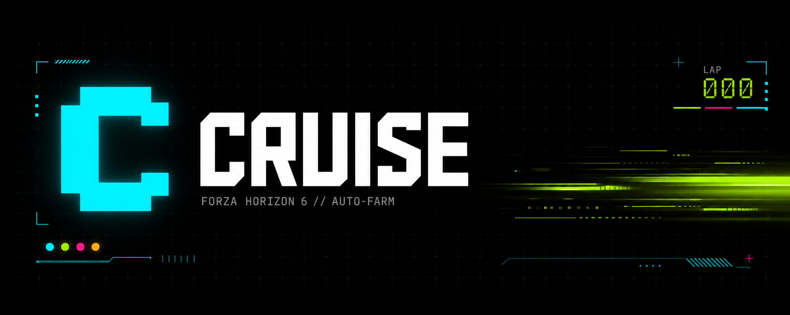

# Cruise



AFK auto-farm for Forza Horizon 6 EventLab races. Cruise holds acceleration, detects the
on-screen state by pixel color (pre-race menu, results, pause menu) and loops the race —
keyboard or emulated Xbox controller — with a native UI. It can read Forza's **Data Out
telemetry** for speed-aware stuck recovery (rewinds onto the track only when truly stopped)
and drive a **Discord Rich Presence** showing your live car, speed and gear.

## Run

Standalone single-file build (no Python needed): **`dist\Cruise.exe`** (~18 MB) —
the **native-window** build. On first launch it writes a default `config.json` (and a
`cars.json` car database) next to the exe, so a bare `Cruise.exe` works on its own;
`config.json` then stores your settings.

From source:
- `py desktop.py` — native window (same UI as `Cruise.exe`)
- `py server.py` — runs the UI in your browser (`127.0.0.1:8733`)

Build the exe with `build_desktop.bat` (native, the shipped `Cruise.exe`) or
`build.bat` (browser variant); both output `dist\Cruise.exe`.

## Features

- **Generic EventLab detection** — same menus across events, no per-race calibration.
- **Input modes** — keyboard (DirectInput) or emulated Xbox 360 pad (vgamepad / ViGEm).
  Selecting GAMEPAD connects the virtual pad; KEYBOARD disconnects it.
- **Window-adaptive** — works fullscreen or windowed, any size/position, multi-monitor.
  Detection maps to the FH6 client area, recomputed each tick.
- **Guards** — pauses if FH6 loses focus (alt-tab) or a pause/dashboard menu shows;
  auto-presses Esc/B once to dismiss the in-race pause menu and resume.
- **Launch at GO** — holds throttle through loading + the 3-2-1 countdown.
- **Instant start** — auto-focuses the FH6 window, then accelerates.
- **Lap counter** — counts one lap per "Start Race Event".
- **Stuck recovery** — when the car stops moving it taps the in-game **Rewind**
  (`recover_mode: "rewind"`, default) or backs up and steers (`"maneuver"`). With
  Data Out telemetry on, recovery is **speed-gated**: it only fires at ≈ 0 km/h, so
  jumps and off-road runs don't trigger a false rewind.
- **Telemetry (Forza Data Out)** — reads real speed / gear / car over UDP. Enable in
  the **TELEMETRY** section and in FH6: Settings → HUD & Gameplay → Data Out.
- **Discord Rich Presence** — shows your live car, `speed km/h - Gear N` and an FH6
  session timer on Discord. Toggle it in the **DISCORD RICH PRESENCE** section.

## Setup (in the app)

See the **SETUP GUIDE** tab. Summary:

1. Run FH6 in **borderless / windowed fullscreen**.
2. Difficulty & Settings: Unbeatable, All Assists, Auto-Steering, Automatic shifting,
   Launch Control On (+50% bonus CR).
3. Load an EventLab farm (codes in the **EVENTLAB CODES** tab) with the
   **1998 Subaru Impreza 22B-STi**.
4. Reach the pre-race menu, pick input mode/keys in **CONTROLLER**, hit **START**.

Failsafe: slam the mouse into the top-left corner to abort.

## config.json
| key | role |
|-----|------|
| `input_backend` | `keyboard` or `gamepad` |
| `accelerate_key` | key held to drive (keyboard mode) |
| `steer_key` | optional steering key (`null` = none) |
| `start_delay_s` | delay before the loop starts (`0` = instant) |
| `loop_poll_s` | polling interval |
| `game_process` / `game_window_title` | FH6 process / window for detection |
| `pause_when_unfocused` | pause when FH6 isn't the foreground window |
| `menu_resume_tries` | how many times to retry the resume key to leave a pause menu (default 3) |
| `recover_mode` | `rewind` (tap in-game Rewind) or `maneuver` (reverse + steer) |
| `rewind_key` / `rewind_wait_s` | Rewind key (keyboard) and pause for the rewind to play |
| `stuck_speed_kmh` | speed below which the car counts as stopped (telemetry recovery) |
| `telemetry_enabled` / `telemetry_host` / `telemetry_port` | Forza Data Out UDP listener |
| `rich_presence_enabled` / `rich_presence_interval_s` / `discord_client_id` | Discord Rich Presence |
| `states[]` | detected screens: `pixels` (`x,y` as fractions of the FH6 window, `rgb`, `tol`) or a lime `band` (`x0,x1,y`, `rgb`, `tol`, `min_hits`), `keys`, flags (`guard`, `resume_key`, `count_lap`, `hold_during_wait`) |

## Telemetry & Discord Rich Presence

Cruise can read Forza's **Data Out** telemetry. In FH6: **Settings → HUD & Gameplay →
Data Out: ON**, IP = `127.0.0.1`, Port = `5300` (match the **TELEMETRY** section).

- **Speed-gated recovery** — the bot only rewinds when telemetry reports ≈ 0 km/h, so
  airborne jumps and off-road runs (still fast) don't cause a false rewind.
- **Discord Rich Presence** — with Discord running, the **DISCORD RICH PRESENCE** section
  shows your live car name, `speed km/h - Gear N` and a session-elapsed timer. It uses
  the bundled `cars.json` for car names and updates every 4 s (Discord's rate limit).
  Uncheck *Show on Discord* to hide it.

## Build
```powershell
build_desktop.bat   REM native window -> dist\Cruise.exe
build.bat           REM browser       -> dist\Cruise.exe
```
Both produce a single-file `dist\Cruise.exe`; build the variant you want.

## Notes
- **Lightweight by design** — screen reading uses raw Windows GDI (`screen.py`) instead of
  Pillow, and the UI is served by the stdlib `http.server` instead of FastAPI/uvicorn.
  No Pillow / FastAPI / pydantic in the bundle → ~18 MB single file (no UPX: it corrupts
  lazily-imported modules in a onefile archive).
- Forza uses DirectInput / controller input; `pydirectinput` and `vgamepad` drive it at a
  low level. Gamepad mode needs the **ViGEmBus** driver installed.
- Borderless/windowed (not exclusive fullscreen) is required for pixel detection.
- The local server binds `127.0.0.1` only and validates `Host`/`Origin` (no remote access).
- **Capturing Cruise in OBS** — the native window uses WebView2 (Chromium), which OBS'
  classic *Window Capture (BitBlt)* renders black. Set the source **Capture Method** to
  **"Windows 10 (1903 and up)"** (Windows Graphics Capture). The desktop build already
  runs with GPU/DirectComposition off so it stays light.
